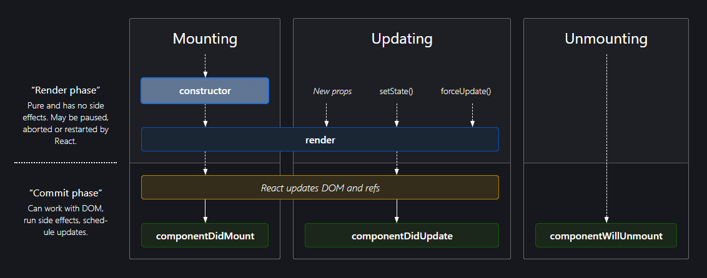

## Assignment

#### Q1. What is the order of lifecycle method calls in class based components?



**Mounting**

These methods are called in the following order when an instance of a component is being created and inserted into the DOM:

- constructor()
- render()
- componentDidMount()

**Updating**

An update can be caused by changes to props or state. These methods are called in the following order when a component is being re-rendered:

- render()
- componentDidUpdate()

**Unmounting**

This method is called when a component is being removed from the DOM:

- componentWillUnmount()

#### Q2. Why do we use componentDidMount, componentDidUpdate & componentWillUnmount

`componentDidMount`, `componentDidUpdate`, and `componentWillUnmount` are lifecycle methods in class-based React components. They allow you to perform specific actions at different stages of a component's lifecycle.

1. **`componentDidMount`**:

   - This lifecycle method is called after the component has been inserted into the DOM (Document Object Model).
   - It is commonly used for performing tasks that require interaction with the DOM or external data fetching, such as making API requests, setting up event listeners, or initializing third-party libraries.
   - `componentDidMount` runs only once, immediately after the initial rendering of the component.

   ```jsx
   componentDidMount() {
     // Perform setup or data fetching here
   }
   ```

2. **`componentDidUpdate`**:

   - This method is called whenever the component updates or receives new props.
   - It is useful for responding to changes in state or props and performing actions based on those changes.
   - It receives two arguments: `prevProps` and `prevState`, which allow you to compare the previous props and state with the current ones to make decisions.

   ```jsx
   componentDidUpdate(prevProps, prevState) {
     // Check for changes in props or state and respond accordingly
   }
   ```

3. **`componentWillUnmount`**:

   - This method is called just before the component is removed from the DOM and destroyed.
   - It is commonly used to clean up resources or perform necessary cleanup tasks like removing event listeners or canceling asynchronous operations to prevent memory leaks.
   - Once `componentWillUnmount` is called, the component is no longer accessible.

   ```jsx
   componentWillUnmount() {
     // Perform cleanup tasks here
   }
   ```

It's important to note that with the introduction of functional components and React hooks, you can achieve similar functionality with hooks like `useEffect`. Functional components with hooks have become the preferred way of managing component lifecycle and side effects in modern React applications, making the code more concise and easier to reason about.

#### Q3. Why do we ude super(props)?

In a class-based component in React, `super(props)` is used to call the constructor of the parent class, which in this case is `Component` from React's core library. The `super(props)` call is typically the first statement inside the constructor of a class-based component.

Here's why you use `super(props)` in a React component:

1. **Inheritance**: React components are JavaScript classes that inherit properties and behavior from the `Component` class provided by React. When you create your own class-based component by extending `Component`, you need to call the constructor of the parent class (`Component`) to ensure that it sets up any necessary internal state and behavior.

2. **Passing Props**: `super(props)` is used to pass the `props` parameter to the constructor of the parent class. The `props` parameter contains the properties (or props) that are passed to your component when it's used in other parts of your application. By passing `props` to `super(props)`, you allow React to handle props correctly and set up the component with the data it needs.
